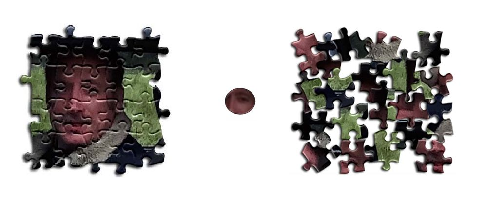
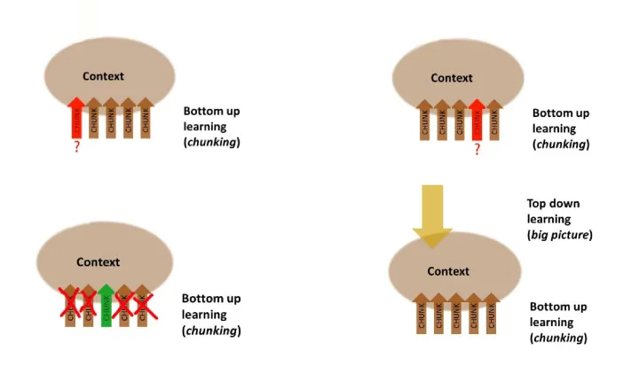
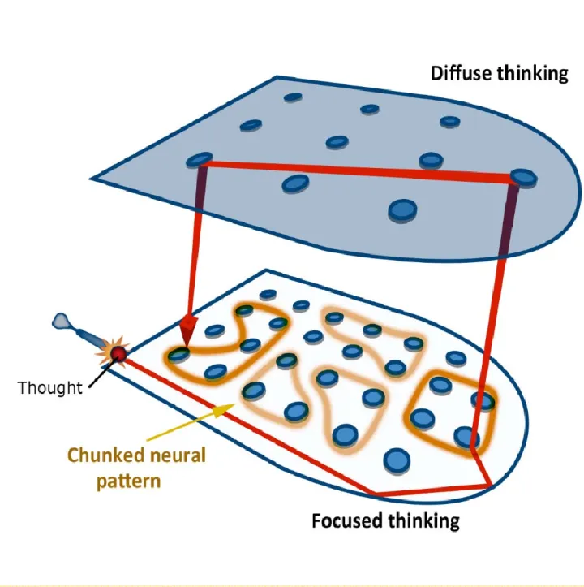

# learning-how-to-learn
## Thinking Modes
我们常见的思考方式可以分为两种，即**Focused Mode**和**Diffuse Mode**。前者指的是我们专注于某件事的思维方式，而后者指的是我们在放松的条件下思索或者回忆问题。  
  
**Focused Mode**适合用于解决已经熟练掌握的内容，而**Diffuse Mode**则对于新事物的学习至关重要。这两种模式也分别对应了两种不同的思维模式：**顺序思考（Sequential Thinking）和整体思考（Holistic Thinking）**。我们需要能够在两种思维模式中切换，比如在遇到困难时可以放松大脑发散地思考问题，当或者灵感时回到手头的工作中，再进行专注的思考。
## Memories
### Working Memory and Long-term Memory
**Working Memoey**指的是我们当下手头正在做的工作，可以简单的理解为短期记忆，最终我们希望把短期记忆变为长期记忆，即**Long-term Memory**。有如下的方法可以帮助我们实现转化：
1. **Practice and Repetition**
**Practice and Repetition**意味着我们需要不断地重复来加深我们的记忆。这里的重复不是在一天内大量的重复，而是*间歇性重复（Spaced Repetition）*。
2. **Memory Tricks**
**Memory Tricks**指的是一些记忆的技巧。比如可以动手书写，利用图像与记忆的内容做联想，或者是在睡前花几分钟温习今天学过的内容。
3. **Pomodoro**
**Pomodoro**是一个定时的提醒器，一般划分20到30分钟的学习区间，在这段时间里我们需要专注地学习和思考。在休息的几分钟里，我们放空大脑，进入**Diffuse Mode**模式来帮助我们理解刚刚学习过的内容。
## Chunking
在刚开始学习一个新概念时，大量的信息涌入，我们的*认知负载（Cognitive Load）* 很重，很难把握全局。大脑需要一个过程来理解和消化这些内容并将它们组合到一起，这个过程就是 **Chunking**。我的理解就是，在学习的过程中，我们的大脑会形成一个个的模块，这些模块一开始很散乱，如何将模块拼接形成一个整体决定我们学习效果的好坏，就像拼拼图一样，将所有的知识串联起来。如果我们只是被动地接收知识而没有把它们**Chunking**起来，这些知识就好比下图中间那块没有锯齿边的拼图块。它无法与其他知识相关联，也就无法为我们所用。  
   
在课堂上，老师认为一个良好的**Chunk**应该是只占用很小一部分空间，但是却能激活反复使用的稳固的神经回路，这使得我么能更快地回想曾今学过的内容，也有利于将已经掌握的部分嵌入更大的框架中。
### The Ways to Enhance Chunk
1. **Practice and Repetition**
2. **Divide and Conquer**  
如果一个 Chunk 对你来说太大了，就把它们拆分然后各个击破。老师给了一个练习乐曲的例子。可以将一个乐曲拆分成一个个小段，熟练各小段后合起来演奏。
3. **Workout Roadmap**  
关注过程而不仅是结果。例如一个计算题，需要我们掌握的更多是推导和理解公式。
### Formation of Chunks
*    把注意力集中在你所面对的信息上。尽量不要让无关的事情占用你的 Working Memory。
*    试图理解所学内容的主旨。
     >即使当时理解了也未必意味着**Chunking**成功了。例如上课听懂的例题可能下次又没有思路了。为了避免这种情况，我们需要自己再琢磨一遍，之后及时地复习来巩固已经形成的神经回路。
*    扩大思考的范围，来了解**Chunk**对应的**Context**。在思考的过程中，分为*自顶向下*和*自底向上*的两种情况。前者帮我们了解全局，而后者让我们知道在**Context**中如何选取已经形成的**Chunk**。  
  
### Recall
在复习已经学过的知识时，我们常会不断重复翻看内容或者是做一张思维导图来理清概念间的关系。但研究表明，这些方法都不如**回想（Recall）**。我们可以用以下两种方式实现**Recall**
*    使用**费曼技巧**。**费曼技巧**指的是用一句话来解释概念，这意味着我们需要从冗长的描述中总结出自己的话来。
*    尝试在不同的环境下学习。
###  Illusion of Competence  
**Illusion of Competence**指的是我们误以为已经掌握和理解了知识。但实际上这是一种错觉，是否真正的理解可以用阶段性的自我测试来检验。这个学习方式让我回想起我在考研数学时遇到的问题，在看完视频讲解或者翻看答案后我以为自己已经掌握了这部分知识，然而实际当我再次遇到类似的问题，居然犯下了重复的错误。我发现我犯的错误总是类似的，就是因为我没有进行及时的自我测试，错估了自己的能力。
### Transfer  
**Transfer**同上述所讲述的内容一样，同是为**Chunk**服务的。**Chunk**之间是相互联系的，不仅可以掌握旧有的知识，当我们遇到新问题时，我们脑中已有的**Chunk**对应的神经回路就有可能经过排列组合调出正确的答案。  
  
## Overlearning  
**Overlearning（过度学习）** 指的是在已经掌握所学的内容后继续重复练习的行为。过度的重复是一种时间上的浪费，同时由于重复练习已经掌握的内容比较容易，它让我们产生**Illusion of Competence**这样的错觉。正确的做法是在困难和重要的内容上适当地过度学习。
## Einstellung  
**Einstellung（定势）** 指的是原有的思维阻碍了我们产生更新的更好的想法。我的理解是固有的思维模式有时会引导我们掉入陷阱，我们可以用**Diffuse Mode**来客服。
## Interleaving
**Interleaving（交错）** 指的是不断地在需要不同策略和技巧来解决的问题之间来回反复。交错与前文提到的间歇性重复这两个技巧可以完美地搭配在一起。
## Procrastination
**Procrastination（拖延症）** 是我们很多人都有的坏毛病。拖延症让我们习惯临时抱佛脚的学习和工作模式，但这样短期的高强度学习往往是混乱的，无法在大脑中形成稳固的神经回路。我们可以从不同的方面来看待拖延症，并克服它。  
### Zombie Mode
所谓**僵尸模式（Zombie Mode）**，是指大脑在受到特定的外界刺激时会做出习惯性的反应。当我们感觉不快时，会将注意力转移到另一间愉快的事情上。这种短期上瘾的模式一旦形成，就变成了拖延症。我们可以采用以下的方法来客服拖延症：  
### The Ways to beat Zombie Mode
1. **Harnessing Zombies**  
尽量使自己处于不需要对抗拖延的境地，或是反过来用尽量少的意志力来利用僵尸模式帮助自己。
2. **Focus on Process rather than Product**  
当你专注于过程，大脑就可以进入僵尸模式无脑前进了。通过专注于享受学习的过程，你可以避免陷入拖延的恶性循环。
3. **Tasklists**  
*    坚持写周计划和日计划，并且最好在睡前做。因为研究显示入睡时潜意识会进入类似于**Diffuse Mode**的状态来消化要完成的项目。
*    把最困难最厌恶的事情放在早上第一件事做
*    在日计划中定好结束学习的时间。
*    >我们会定一个开始时间，但往往忽略了结束时间。定一个结束时间有助于我们的日程规律，同时让我们在一天中有别的时间放在锻炼和放松等事情上。
## Metaphor and Analogy
为所学的内容创造**比喻（Metaphor）和类推（Analogy）** 能够帮助我们更好地理解内容本身，同时它们将新事物与旧的神经回路联系了起来。
## The Value of Teamwork
团队工作能够让我们跳出**Focused Mode**下的思维定势，同时能弥补我们思维的空缺，建立起更强的自我纠正能力。从这个意义上讲，合作的人们就好像是我们的外部**Diffuse Mode**。
## Test Checklist
考试有助于我们阶段性地检测所学，这里我选取并引用*Dr. Richard Felder*的考前自问的一部分：  
*    Did you make a serious effort to understand the text?
*    Diy you work with classmates on homework problems?
*    Did you attempt to outline every homework problem solution?
*    Did you ask in class for explanations of homework problem solutions that weren’t clear to you?  
这里的第四条给了我一些启发。过去的学习中我很少求助于同学，对于不懂的问题我习惯查阅各种资料或者直接去问老师，但是我显然忽略了上文中所讲的**The Value of Teamwork**，这让我明白及时和同学交流的重要性，它可以帮助我们建立团队合作的精神，同时可以更高效率的帮助我们的学习。
## Test Tips
在课程中，老师介绍了很多考试的小技巧，例如：  
*    **Hard Start - Jump to Easy**
*    >从困难的问题出发，将它们“加载”到大脑中，然后跳回去做简单的问题，从而使大脑进入 Diffuse Mode，这样就很有可能在较短的时间内找到难题的思路。
*    **Get Excited**
*    >不去想“这场考试让我恐惧”而是“这场考试让我兴奋”。
*    **Deep Breathing**
*    >通过深呼吸来抵消这心慌反应，不要让紧张的情绪蔓延大脑。  
*    **Don’t Let the Brain Fool Yourself**
*    >在考试过程中要时刻小心，可以多眨眨眼或是晃晃头，用这种方式来提醒自己稍微往**Diffuse Mode**倾斜看看有没有出错。
# what I have got from learning how to learn
从本次的课程中，我学到了不同的思维方法和学习以及记忆的技巧，我希望能把这些学习的方法应用到实际的学习和生活中去，同时我也总结了一些在过去犯的学习上的错误。我创建了一个新的GitHub账号，在研究生阶段，我想把我的每一次有价值的学习和code提交到我的GitHub上，以此来记录我的研究生学习生活。  
这次的课程在bilibili[Learning how to learn](https://www.bilibili.com/video/BV1rx411Z7LV/?spm_id_from=333.337.search-card.all.click&vd_source=f49ab96c2920ffc67b3af916a3b70504)上可以找到对应的视频，有很多和我一样的国内大学生在讨论，收获了很多新的想法。  
[我的Github](https://github.com/zhangruiouc)。

